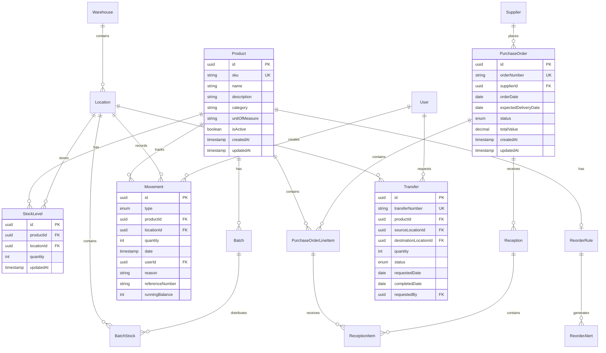
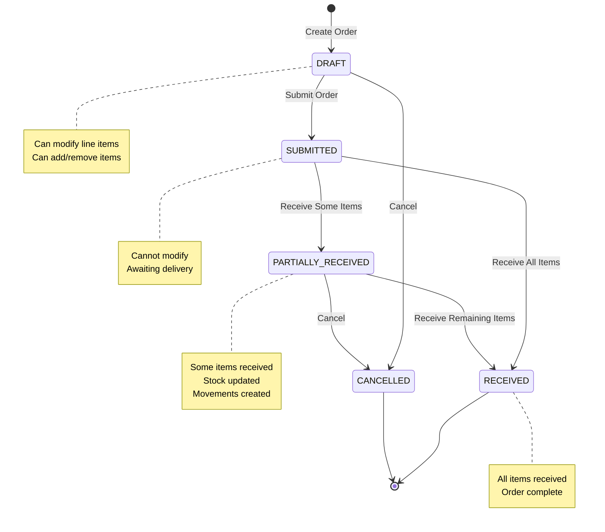
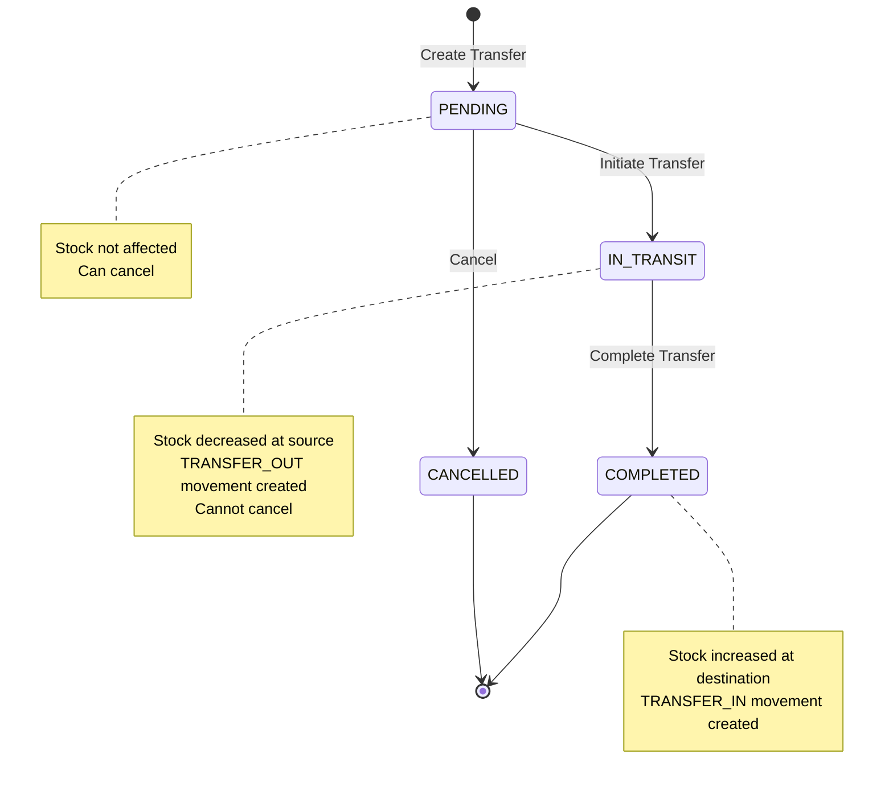
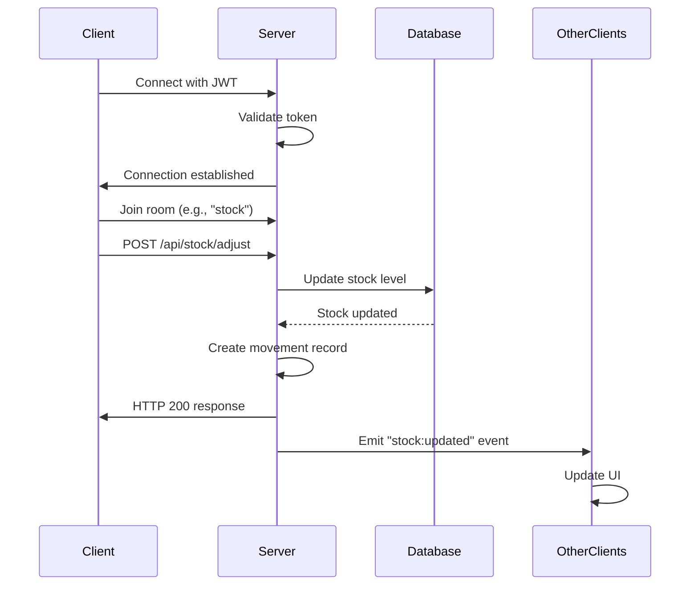
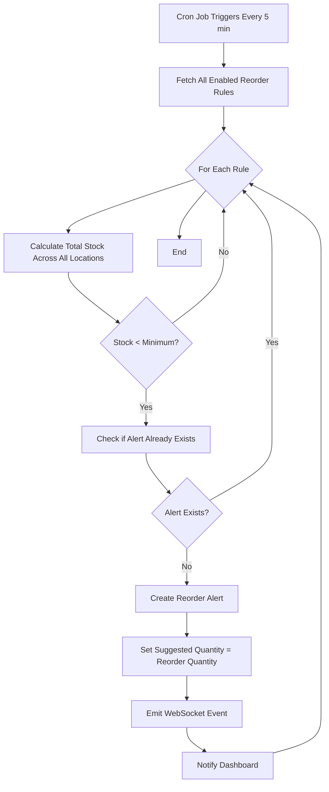

# Diseño Técnico - DaCodes Inventory System

## Overview

DaCodes Inventory es un sistema de gestión de inventario empresarial construido con arquitectura modular y separación clara entre frontend y backend. El sistema proporciona control en tiempo real sobre productos, stock, almacenes, proveedores y movimientos de inventario.

### Objetivos del Diseño

- **Modularidad**: Arquitectura basada en módulos independientes y reutilizables
- **Escalabilidad**: Diseño preparado para crecimiento en volumen de datos y usuarios
- **Tiempo Real**: Actualizaciones instantáneas mediante WebSockets
- **Mantenibilidad**: Código limpio, tipado fuerte y separación de responsabilidades
- **Extensibilidad**: Preparado para integración futura con IA y analytics

### Stack Tecnológico

**Frontend:**
- React 18+ con TypeScript
- Vite como build tool
- React Query para state management y caching
- Socket.io-client para WebSockets
- React Router para navegación
- Tailwind CSS para estilos

**Backend:**
- Node.js 20+ LTS
- Express con TypeScript
- Socket.io para WebSockets
- Prisma como ORM
- Zod para validación
- JWT para autenticación

**Base de Datos:**
- PostgreSQL 15+
- Migraciones con Prisma Migrate

**Testing:**
- Vitest para unit y property tests
- Supertest para integration tests
- React Testing Library para componentes
- Playwright para E2E tests


## Architecture

### Arquitectura General

El sistema sigue una arquitectura de tres capas con separación clara entre presentación, lógica de negocio y persistencia:

```
┌─────────────────────────────────────────────────────────────┐
│                      FRONTEND (React)                        │
│  ┌──────────────┐  ┌──────────────┐  ┌──────────────┐      │
│  │  Components  │  │  React Query │  │  WebSocket   │      │
│  │   (Views)    │  │   (State)    │  │   Client     │      │
│  └──────────────┘  └──────────────┘  └──────────────┘      │
└─────────────────────────────────────────────────────────────┘
                            │
                    HTTP/REST + WebSocket
                            │
┌─────────────────────────────────────────────────────────────┐
│                    BACKEND (Node.js/Express)                 │
│  ┌──────────────┐  ┌──────────────┐  ┌──────────────┐      │
│  │   Routes     │  │  Controllers │  │  WebSocket   │      │
│  │  (API Layer) │  │   (Logic)    │  │   Server     │      │
│  └──────────────┘  └──────────────┘  └──────────────┘      │
│  ┌──────────────┐  ┌──────────────┐  ┌──────────────┐      │
│  │   Services   │  │  Validators  │  │  Middleware  │      │
│  │  (Business)  │  │    (Zod)     │  │   (Auth)     │      │
│  └──────────────┘  └──────────────┘  └──────────────┘      │
│  ┌──────────────┐                                           │
│  │  Repositories│                                           │
│  │ (Data Access)│                                           │
│  └──────────────┘                                           │
└─────────────────────────────────────────────────────────────┘
                            │
                      Prisma ORM
                            │
┌─────────────────────────────────────────────────────────────┐
│                    DATABASE (PostgreSQL)                     │
│  ┌──────────────┐  ┌──────────────┐  ┌──────────────┐      │
│  │   Products   │  │    Stock     │  │  Warehouses  │      │
│  │  Suppliers   │  │ PurchaseOrders│ │  Movements   │      │
│  │   Batches    │  │  Transfers   │  │    Users     │      │
│  └──────────────┘  └──────────────┘  └──────────────┘      │
└─────────────────────────────────────────────────────────────┘
```

### Patrones Arquitectónicos

**Backend:**
- **Repository Pattern**: Abstracción de acceso a datos
- **Service Layer**: Lógica de negocio centralizada
- **Dependency Injection**: Inyección de dependencias para testabilidad
- **DTO Pattern**: Data Transfer Objects para validación
- **Unit of Work**: Transacciones coordinadas

**Frontend:**
- **Component-Based**: Componentes reutilizables
- **Container/Presenter**: Separación de lógica y presentación
- **Custom Hooks**: Lógica reutilizable
- **Optimistic Updates**: UX mejorada con actualizaciones optimistas


## Components and Interfaces

### Estructura de Carpetas

```
dacodes-inventory/
├── frontend/
│   ├── src/
│   │   ├── components/          # Componentes reutilizables
│   │   │   ├── common/          # Botones, inputs, modales
│   │   │   ├── products/        # Componentes de productos
│   │   │   ├── stock/           # Componentes de stock
│   │   │   ├── warehouses/      # Componentes de almacenes
│   │   │   ├── suppliers/       # Componentes de proveedores
│   │   │   ├── purchase-orders/ # Componentes de órdenes
│   │   │   ├── transfers/       # Componentes de transferencias
│   │   │   └── dashboard/       # Componentes del dashboard
│   │   ├── hooks/               # Custom hooks
│   │   │   ├── useProducts.ts
│   │   │   ├── useStock.ts
│   │   │   ├── useWebSocket.ts
│   │   │   └── useAuth.ts
│   │   ├── pages/               # Páginas/vistas principales
│   │   │   ├── Dashboard.tsx
│   │   │   ├── Products.tsx
│   │   │   ├── Stock.tsx
│   │   │   ├── Warehouses.tsx
│   │   │   ├── Suppliers.tsx
│   │   │   ├── PurchaseOrders.tsx
│   │   │   └── Transfers.tsx
│   │   ├── services/            # API clients
│   │   │   ├── api.ts
│   │   │   └── websocket.ts
│   │   ├── types/               # TypeScript types
│   │   │   └── index.ts
│   │   ├── utils/               # Utilidades
│   │   │   ├── formatters.ts
│   │   │   └── validators.ts
│   │   ├── App.tsx
│   │   └── main.tsx
│   ├── package.json
│   ├── tsconfig.json
│   ├── vite.config.ts
│   └── tailwind.config.js
│
├── backend/
│   ├── src/
│   │   ├── modules/             # Módulos de negocio
│   │   │   ├── products/
│   │   │   │   ├── product.controller.ts
│   │   │   │   ├── product.service.ts
│   │   │   │   ├── product.repository.ts
│   │   │   │   ├── product.validator.ts
│   │   │   │   └── product.routes.ts
│   │   │   ├── stock/
│   │   │   │   ├── stock.controller.ts
│   │   │   │   ├── stock.service.ts
│   │   │   │   ├── stock.repository.ts
│   │   │   │   ├── stock.validator.ts
│   │   │   │   └── stock.routes.ts
│   │   │   ├── warehouses/
│   │   │   ├── suppliers/
│   │   │   ├── purchase-orders/
│   │   │   ├── receptions/
│   │   │   ├── movements/
│   │   │   ├── transfers/
│   │   │   ├── batches/
│   │   │   ├── reorder/
│   │   │   └── auth/
│   │   ├── shared/              # Código compartido
│   │   │   ├── middleware/
│   │   │   │   ├── auth.middleware.ts
│   │   │   │   ├── error.middleware.ts
│   │   │   │   └── validation.middleware.ts
│   │   │   ├── types/
│   │   │   │   └── index.ts
│   │   │   └── utils/
│   │   │       ├── logger.ts
│   │   │       └── response.ts
│   │   ├── config/              # Configuración
│   │   │   ├── database.ts
│   │   │   ├── env.ts
│   │   │   └── websocket.ts
│   │   ├── prisma/              # Prisma schema y migraciones
│   │   │   ├── schema.prisma
│   │   │   └── migrations/
│   │   ├── app.ts               # Express app setup
│   │   └── server.ts            # Server entry point
│   ├── tests/                   # Tests
│   │   ├── unit/
│   │   ├── integration/
│   │   └── property/
│   ├── package.json
│   ├── tsconfig.json
│   └── vitest.config.ts
│
├── .gitignore
├── README.md
└── docker-compose.yml           # PostgreSQL para desarrollo
```


### Módulos del Sistema

#### 1. Product Catalog Module (products/)

**Responsabilidad**: Gestión del catálogo de productos

**Componentes:**
- `ProductController`: Maneja requests HTTP
- `ProductService`: Lógica de negocio (validación SKU único, búsqueda)
- `ProductRepository`: Acceso a datos con Prisma
- `ProductValidator`: Schemas Zod para validación

**Interfaces Principales:**
```typescript
interface Product {
  id: string;
  sku: string;
  name: string;
  description: string | null;
  category: string;
  unitOfMeasure: string;
  isActive: boolean;
  createdAt: Date;
  updatedAt: Date;
}

interface CreateProductDTO {
  sku: string;
  name: string;
  description?: string;
  category: string;
  unitOfMeasure: string;
}
```

**Endpoints:**
- `POST /api/products` - Crear producto
- `GET /api/products` - Listar productos (con filtros)
- `GET /api/products/:id` - Obtener producto
- `PUT /api/products/:id` - Actualizar producto
- `DELETE /api/products/:id` - Eliminar producto (soft delete)

#### 2. Stock Management Module (stock/)

**Responsabilidad**: Control de niveles de stock por ubicación

**Componentes:**
- `StockController`: Maneja requests HTTP
- `StockService`: Lógica de negocio (prevención de negativos, cálculos)
- `StockRepository`: Acceso a datos con Prisma
- `StockValidator`: Schemas Zod para validación

**Interfaces Principales:**
```typescript
interface StockLevel {
  id: string;
  productId: string;
  locationId: string;
  quantity: number;
  updatedAt: Date;
}

interface StockQuery {
  productId?: string;
  warehouseId?: string;
  locationId?: string;
}
```

**Endpoints:**
- `GET /api/stock` - Consultar stock (con filtros)
- `GET /api/stock/product/:productId` - Stock por producto
- `GET /api/stock/location/:locationId` - Stock por ubicación
- `POST /api/stock/adjust` - Ajuste manual de stock

**WebSocket Events:**
- `stock:updated` - Emitido cuando cambia el stock

#### 3. Warehouse Management Module (warehouses/)

**Responsabilidad**: Gestión de almacenes y ubicaciones

**Componentes:**
- `WarehouseController`: Maneja requests HTTP
- `WarehouseService`: Lógica de negocio (validación capacidad)
- `WarehouseRepository`: Acceso a datos con Prisma
- `WarehouseValidator`: Schemas Zod para validación

**Interfaces Principales:**
```typescript
interface Warehouse {
  id: string;
  name: string;
  address: string;
  isActive: boolean;
  createdAt: Date;
}

interface Location {
  id: string;
  warehouseId: string;
  code: string;
  capacity: number | null;
  isActive: boolean;
}
```

**Endpoints:**
- `POST /api/warehouses` - Crear almacén
- `GET /api/warehouses` - Listar almacenes
- `POST /api/warehouses/:id/locations` - Crear ubicación
- `GET /api/warehouses/:id/locations` - Listar ubicaciones

#### 4. Supplier Management Module (suppliers/)

**Responsabilidad**: Gestión de proveedores

**Componentes:**
- `SupplierController`: Maneja requests HTTP
- `SupplierService`: Lógica de negocio
- `SupplierRepository`: Acceso a datos con Prisma
- `SupplierValidator`: Schemas Zod para validación

**Interfaces Principales:**
```typescript
interface Supplier {
  id: string;
  name: string;
  contactName: string | null;
  email: string | null;
  phone: string | null;
  paymentTerms: string | null;
  leadTimeDays: number;
  isActive: boolean;
}
```

**Endpoints:**
- `POST /api/suppliers` - Crear proveedor
- `GET /api/suppliers` - Listar proveedores
- `PUT /api/suppliers/:id` - Actualizar proveedor


#### 5. Purchase Order Module (purchase-orders/)

**Responsabilidad**: Gestión de órdenes de compra

**Componentes:**
- `PurchaseOrderController`: Maneja requests HTTP
- `PurchaseOrderService`: Lógica de negocio (cálculos, validación estado)
- `PurchaseOrderRepository`: Acceso a datos con Prisma
- `PurchaseOrderValidator`: Schemas Zod para validación

**Interfaces Principales:**
```typescript
enum PurchaseOrderStatus {
  DRAFT = 'DRAFT',
  SUBMITTED = 'SUBMITTED',
  PARTIALLY_RECEIVED = 'PARTIALLY_RECEIVED',
  RECEIVED = 'RECEIVED',
  CANCELLED = 'CANCELLED'
}

interface PurchaseOrder {
  id: string;
  orderNumber: string;
  supplierId: string;
  orderDate: Date;
  expectedDeliveryDate: Date;
  status: PurchaseOrderStatus;
  totalValue: number;
  lineItems: PurchaseOrderLineItem[];
}

interface PurchaseOrderLineItem {
  id: string;
  purchaseOrderId: string;
  productId: string;
  quantity: number;
  unitPrice: number;
  receivedQuantity: number;
}
```

**Endpoints:**
- `POST /api/purchase-orders` - Crear orden
- `GET /api/purchase-orders` - Listar órdenes
- `GET /api/purchase-orders/:id` - Obtener orden
- `PUT /api/purchase-orders/:id` - Actualizar orden (solo DRAFT)
- `POST /api/purchase-orders/:id/submit` - Enviar orden
- `POST /api/purchase-orders/:id/cancel` - Cancelar orden

**WebSocket Events:**
- `purchase-order:status-changed` - Emitido cuando cambia el estado

#### 6. Reception Module (receptions/)

**Responsabilidad**: Recepción de órdenes de compra

**Componentes:**
- `ReceptionController`: Maneja requests HTTP
- `ReceptionService`: Lógica de negocio (actualización stock, movimientos)
- `ReceptionRepository`: Acceso a datos con Prisma
- `ReceptionValidator`: Schemas Zod para validación

**Interfaces Principales:**
```typescript
interface Reception {
  id: string;
  purchaseOrderId: string;
  receivedDate: Date;
  receivedBy: string;
  items: ReceptionItem[];
}

interface ReceptionItem {
  lineItemId: string;
  receivedQuantity: number;
  locationId: string;
  batchNumber?: string;
  expirationDate?: Date;
}
```

**Endpoints:**
- `POST /api/receptions` - Registrar recepción
- `GET /api/receptions` - Listar recepciones
- `GET /api/receptions/purchase-order/:id` - Recepciones por orden

#### 7. Movement Tracking Module (movements/)

**Responsabilidad**: Registro de todos los movimientos de stock

**Componentes:**
- `MovementController`: Maneja requests HTTP
- `MovementService`: Lógica de negocio (cálculo de balance)
- `MovementRepository`: Acceso a datos con Prisma
- `MovementValidator`: Schemas Zod para validación

**Interfaces Principales:**
```typescript
enum MovementType {
  RECEIPT = 'RECEIPT',
  SHIPMENT = 'SHIPMENT',
  ADJUSTMENT = 'ADJUSTMENT',
  TRANSFER_OUT = 'TRANSFER_OUT',
  TRANSFER_IN = 'TRANSFER_IN',
  EXPIRATION = 'EXPIRATION'
}

interface Movement {
  id: string;
  type: MovementType;
  productId: string;
  locationId: string;
  quantity: number;
  date: Date;
  userId: string;
  reason: string | null;
  referenceNumber: string | null;
  runningBalance: number;
}
```

**Endpoints:**
- `GET /api/movements` - Listar movimientos (con filtros)
- `GET /api/movements/product/:productId` - Movimientos por producto
- `GET /api/movements/location/:locationId` - Movimientos por ubicación

**Reglas de Negocio:**
- Los movimientos son inmutables (no se pueden editar ni eliminar)
- Cada cambio de stock genera automáticamente un movimiento
- El running balance se calcula en tiempo de inserción


#### 8. Transfer Module (transfers/)

**Responsabilidad**: Transferencias entre almacenes

**Componentes:**
- `TransferController`: Maneja requests HTTP
- `TransferService`: Lógica de negocio (validación stock, transacciones)
- `TransferRepository`: Acceso a datos con Prisma
- `TransferValidator`: Schemas Zod para validación

**Interfaces Principales:**
```typescript
enum TransferStatus {
  PENDING = 'PENDING',
  IN_TRANSIT = 'IN_TRANSIT',
  COMPLETED = 'COMPLETED',
  CANCELLED = 'CANCELLED'
}

interface Transfer {
  id: string;
  transferNumber: string;
  productId: string;
  sourceLocationId: string;
  destinationLocationId: string;
  quantity: number;
  status: TransferStatus;
  requestedDate: Date;
  completedDate: Date | null;
  requestedBy: string;
}
```

**Endpoints:**
- `POST /api/transfers` - Crear transferencia
- `GET /api/transfers` - Listar transferencias
- `POST /api/transfers/:id/initiate` - Iniciar transferencia
- `POST /api/transfers/:id/complete` - Completar transferencia
- `POST /api/transfers/:id/cancel` - Cancelar transferencia

**WebSocket Events:**
- `transfer:status-changed` - Emitido cuando cambia el estado

**Flujo de Transferencia:**
1. PENDING: Transferencia creada, stock aún no afectado
2. IN_TRANSIT: Stock decrementado en origen, movimiento TRANSFER_OUT creado
3. COMPLETED: Stock incrementado en destino, movimiento TRANSFER_IN creado
4. CANCELLED: Solo permitido en estado PENDING

#### 9. Batch Management Module (batches/)

**Responsabilidad**: Gestión de lotes y fechas de expiración

**Componentes:**
- `BatchController`: Maneja requests HTTP
- `BatchService`: Lógica de negocio (FEFO, alertas de expiración)
- `BatchRepository`: Acceso a datos con Prisma
- `BatchValidator`: Schemas Zod para validación

**Interfaces Principales:**
```typescript
interface Batch {
  id: string;
  batchNumber: string;
  productId: string;
  manufacturingDate: Date;
  expirationDate: Date;
  isExpired: boolean;
}

interface BatchStock {
  id: string;
  batchId: string;
  locationId: string;
  quantity: number;
}
```

**Endpoints:**
- `GET /api/batches` - Listar lotes
- `GET /api/batches/expiring` - Lotes próximos a expirar (30 días)
- `GET /api/batches/product/:productId` - Lotes por producto
- `POST /api/batches/:id/expire` - Marcar lote como expirado

**Lógica FEFO:**
- Al consumir stock, el sistema selecciona automáticamente el lote con fecha de expiración más cercana
- Los lotes expirados no pueden ser usados en nuevas transacciones

#### 10. Reorder Engine Module (reorder/)

**Responsabilidad**: Motor de reglas de reordenamiento

**Componentes:**
- `ReorderController`: Maneja requests HTTP
- `ReorderService`: Lógica de negocio (evaluación de reglas, generación de alertas)
- `ReorderRepository`: Acceso a datos con Prisma
- `ReorderValidator`: Schemas Zod para validación
- `ReorderScheduler`: Job que evalúa reglas cada 5 minutos

**Interfaces Principales:**
```typescript
interface ReorderRule {
  id: string;
  productId: string;
  minimumQuantity: number;
  reorderQuantity: number;
  isEnabled: boolean;
}

interface ReorderAlert {
  id: string;
  productId: string;
  currentStock: number;
  minimumQuantity: number;
  suggestedOrderQuantity: number;
  createdAt: Date;
  isResolved: boolean;
}
```

**Endpoints:**
- `POST /api/reorder/rules` - Crear regla
- `GET /api/reorder/rules` - Listar reglas
- `PUT /api/reorder/rules/:id` - Actualizar regla
- `GET /api/reorder/alerts` - Listar alertas activas

**WebSocket Events:**
- `reorder:alert-created` - Emitido cuando se genera una alerta

**Scheduler:**
- Cron job que se ejecuta cada 5 minutos
- Evalúa todas las reglas activas
- Compara stock total contra mínimo
- Genera alertas cuando stock < mínimo


#### 11. Authentication Module (auth/)

**Responsabilidad**: Autenticación y autorización

**Componentes:**
- `AuthController`: Maneja requests HTTP
- `AuthService`: Lógica de negocio (JWT, hashing)
- `AuthMiddleware`: Middleware de autenticación
- `AuthValidator`: Schemas Zod para validación

**Interfaces Principales:**
```typescript
enum UserRole {
  ADMIN = 'ADMIN',
  MANAGER = 'MANAGER',
  OPERATOR = 'OPERATOR'
}

interface User {
  id: string;
  email: string;
  passwordHash: string;
  role: UserRole;
  isActive: boolean;
}

interface AuthToken {
  accessToken: string;
  refreshToken: string;
  expiresIn: number;
}
```

**Endpoints:**
- `POST /api/auth/login` - Iniciar sesión
- `POST /api/auth/refresh` - Refrescar token
- `POST /api/auth/logout` - Cerrar sesión
- `GET /api/auth/me` - Obtener usuario actual

**Permisos por Rol:**
- **ADMIN**: Acceso completo a todas las operaciones
- **MANAGER**: Crear/editar productos, proveedores, órdenes, transferencias
- **OPERATOR**: Solo consultas y recepciones

### API Design Patterns

**Request/Response Format:**
```typescript
// Success Response
{
  success: true,
  data: T,
  meta?: {
    page: number,
    pageSize: number,
    total: number
  }
}

// Error Response
{
  success: false,
  error: {
    code: string,
    message: string,
    details?: any
  }
}
```

**Pagination:**
```typescript
GET /api/products?page=1&pageSize=20&sortBy=name&sortOrder=asc
```

**Filtering:**
```typescript
GET /api/products?category=electronics&isActive=true
```

**Field Selection:**
```typescript
GET /api/products?fields=id,sku,name
```

### WebSocket Architecture

**Connection Management:**
- Cliente se conecta con token JWT en handshake
- Server valida token y asocia socket con userId
- Rooms por tipo de entidad (products, stock, orders)

**Event Naming Convention:**
```
{entity}:{action}
Ejemplos: stock:updated, purchase-order:status-changed
```

**Event Payload:**
```typescript
{
  type: string,
  data: any,
  timestamp: Date
}
```


## Data Models

### Prisma Schema

```prisma
// Product Catalog
model Product {
  id              String   @id @default(uuid())
  sku             String   @unique
  name            String
  description     String?
  category        String
  unitOfMeasure   String
  isActive        Boolean  @default(true)
  createdAt       DateTime @default(now())
  updatedAt       DateTime @updatedAt
  
  stockLevels     StockLevel[]
  purchaseOrderItems PurchaseOrderLineItem[]
  movements       Movement[]
  batches         Batch[]
  reorderRule     ReorderRule?
  
  @@index([sku])
  @@index([category])
  @@index([isActive])
}

// Warehouse Management
model Warehouse {
  id        String   @id @default(uuid())
  name      String
  address   String
  isActive  Boolean  @default(true)
  createdAt DateTime @default(now())
  
  locations Location[]
}

model Location {
  id          String   @id @default(uuid())
  warehouseId String
  code        String
  capacity    Int?
  isActive    Boolean  @default(true)
  
  warehouse   Warehouse @relation(fields: [warehouseId], references: [id])
  stockLevels StockLevel[]
  movements   Movement[]
  batchStocks BatchStock[]
  transfersFrom Transfer[] @relation("SourceLocation")
  transfersTo   Transfer[] @relation("DestinationLocation")
  
  @@unique([warehouseId, code])
  @@index([warehouseId])
}

// Stock Management
model StockLevel {
  id         String   @id @default(uuid())
  productId  String
  locationId String
  quantity   Int      @default(0)
  updatedAt  DateTime @updatedAt
  
  product    Product  @relation(fields: [productId], references: [id])
  location   Location @relation(fields: [locationId], references: [id])
  
  @@unique([productId, locationId])
  @@index([productId])
  @@index([locationId])
}

// Supplier Management
model Supplier {
  id              String   @id @default(uuid())
  name            String
  contactName     String?
  email           String?
  phone           String?
  paymentTerms    String?
  leadTimeDays    Int      @default(0)
  isActive        Boolean  @default(true)
  createdAt       DateTime @default(now())
  
  purchaseOrders  PurchaseOrder[]
  
  @@index([name])
}

// Purchase Orders
model PurchaseOrder {
  id                    String   @id @default(uuid())
  orderNumber           String   @unique
  supplierId            String
  orderDate             DateTime
  expectedDeliveryDate  DateTime
  status                PurchaseOrderStatus @default(DRAFT)
  totalValue            Decimal  @db.Decimal(10, 2)
  createdAt             DateTime @default(now())
  updatedAt             DateTime @updatedAt
  
  supplier              Supplier @relation(fields: [supplierId], references: [id])
  lineItems             PurchaseOrderLineItem[]
  receptions            Reception[]
  
  @@index([orderNumber])
  @@index([supplierId])
  @@index([status])
}

enum PurchaseOrderStatus {
  DRAFT
  SUBMITTED
  PARTIALLY_RECEIVED
  RECEIVED
  CANCELLED
}

model PurchaseOrderLineItem {
  id                String   @id @default(uuid())
  purchaseOrderId   String
  productId         String
  quantity          Int
  unitPrice         Decimal  @db.Decimal(10, 2)
  receivedQuantity  Int      @default(0)
  
  purchaseOrder     PurchaseOrder @relation(fields: [purchaseOrderId], references: [id])
  product           Product @relation(fields: [productId], references: [id])
  receptionItems    ReceptionItem[]
  
  @@index([purchaseOrderId])
  @@index([productId])
}

// Receptions
model Reception {
  id                String   @id @default(uuid())
  purchaseOrderId   String
  receivedDate      DateTime
  receivedBy        String
  createdAt         DateTime @default(now())
  
  purchaseOrder     PurchaseOrder @relation(fields: [purchaseOrderId], references: [id])
  items             ReceptionItem[]
  
  @@index([purchaseOrderId])
}

model ReceptionItem {
  id                String   @id @default(uuid())
  receptionId       String
  lineItemId        String
  receivedQuantity  Int
  locationId        String
  batchNumber       String?
  expirationDate    DateTime?
  
  reception         Reception @relation(fields: [receptionId], references: [id])
  lineItem          PurchaseOrderLineItem @relation(fields: [lineItemId], references: [id])
  
  @@index([receptionId])
  @@index([lineItemId])
}

// Movement Tracking
model Movement {
  id              String   @id @default(uuid())
  type            MovementType
  productId       String
  locationId      String
  quantity        Int
  date            DateTime @default(now())
  userId          String
  reason          String?
  referenceNumber String?
  runningBalance  Int
  
  product         Product @relation(fields: [productId], references: [id])
  location        Location @relation(fields: [locationId], references: [id])
  user            User @relation(fields: [userId], references: [id])
  
  @@index([productId])
  @@index([locationId])
  @@index([date])
  @@index([type])
}

enum MovementType {
  RECEIPT
  SHIPMENT
  ADJUSTMENT
  TRANSFER_OUT
  TRANSFER_IN
  EXPIRATION
}

// Transfers
model Transfer {
  id                    String   @id @default(uuid())
  transferNumber        String   @unique
  productId             String
  sourceLocationId      String
  destinationLocationId String
  quantity              Int
  status                TransferStatus @default(PENDING)
  requestedDate         DateTime
  completedDate         DateTime?
  requestedBy           String
  
  sourceLocation        Location @relation("SourceLocation", fields: [sourceLocationId], references: [id])
  destinationLocation   Location @relation("DestinationLocation", fields: [destinationLocationId], references: [id])
  user                  User @relation(fields: [requestedBy], references: [id])
  
  @@index([transferNumber])
  @@index([status])
}

enum TransferStatus {
  PENDING
  IN_TRANSIT
  COMPLETED
  CANCELLED
}

// Batch Management
model Batch {
  id                String   @id @default(uuid())
  batchNumber       String   @unique
  productId         String
  manufacturingDate DateTime
  expirationDate    DateTime
  isExpired         Boolean  @default(false)
  createdAt         DateTime @default(now())
  
  product           Product @relation(fields: [productId], references: [id])
  batchStocks       BatchStock[]
  
  @@index([batchNumber])
  @@index([productId])
  @@index([expirationDate])
}

model BatchStock {
  id         String   @id @default(uuid())
  batchId    String
  locationId String
  quantity   Int
  
  batch      Batch @relation(fields: [batchId], references: [id])
  location   Location @relation(fields: [locationId], references: [id])
  
  @@unique([batchId, locationId])
  @@index([batchId])
  @@index([locationId])
}

// Reorder Rules
model ReorderRule {
  id              String   @id @default(uuid())
  productId       String   @unique
  minimumQuantity Int
  reorderQuantity Int
  isEnabled       Boolean  @default(true)
  createdAt       DateTime @default(now())
  updatedAt       DateTime @updatedAt
  
  product         Product @relation(fields: [productId], references: [id])
  alerts          ReorderAlert[]
  
  @@index([isEnabled])
}

model ReorderAlert {
  id                      String   @id @default(uuid())
  reorderRuleId           String
  productId               String
  currentStock            Int
  minimumQuantity         Int
  suggestedOrderQuantity  Int
  createdAt               DateTime @default(now())
  isResolved              Boolean  @default(false)
  
  reorderRule             ReorderRule @relation(fields: [reorderRuleId], references: [id])
  
  @@index([productId])
  @@index([isResolved])
  @@index([createdAt])
}

// Authentication
model User {
  id           String   @id @default(uuid())
  email        String   @unique
  passwordHash String
  role         UserRole
  isActive     Boolean  @default(true)
  createdAt    DateTime @default(now())
  
  movements    Movement[]
  transfers    Transfer[]
  
  @@index([email])
}

enum UserRole {
  ADMIN
  MANAGER
  OPERATOR
}
```

### Database Indexes Strategy

**Índices Principales:**
- Primary keys (UUID) en todas las tablas
- Unique constraints en campos de negocio (SKU, orderNumber, etc.)
- Foreign keys indexados automáticamente
- Campos de búsqueda frecuente (category, status, dates)

**Optimizaciones:**
- Índices compuestos en queries comunes (productId + locationId)
- Índices parciales para queries filtradas (isActive = true)
- Índices en campos de ordenamiento (createdAt, name)


## Correctness Properties

*A property is a characteristic or behavior that should hold true across all valid executions of a system-essentially, a formal statement about what the system should do. Properties serve as the bridge between human-readable specifications and machine-verifiable correctness guarantees.*

### Property Reflection

After analyzing all acceptance criteria, several redundancies were identified:

**Redundancies Eliminated:**
- Properties 13.4 and 13.3 both test authorization enforcement - combined into single property
- Properties 13.7 and 13.5 both test token expiration - combined into single property
- Properties 15.3 and 15.2 both test transaction rollback - combined into single property
- Properties 15.6 and 15.5 both test optimistic locking - combined into single property
- Properties 1.1, 3.1, and 4.1 all test basic CRUD persistence - generalized into single pattern
- Property 11.5 duplicates 9.5 (batches expiring within 30 days) - removed duplicate

**Properties Combined:**
- Multiple search/filter properties (1.4, 1.5, 4.6, 7.5, 11.7, 14.7) share common filtering logic - consolidated
- Multiple unique ID generation properties (5.1, 8.1) follow same pattern - consolidated
- Multiple state machine properties (5.4, 8.3) follow same validation pattern - consolidated

### Core Properties


#### Property 1: Entity Persistence Round Trip

*For any* valid entity (Product, Warehouse, Supplier, etc.), creating the entity and then retrieving it by ID should return an equivalent entity with all fields preserved.

**Validates: Requirements 1.1, 3.1, 4.1, 5.2, 8.2, 9.1**

#### Property 2: SKU Uniqueness Enforcement

*For any* two products, if they have the same SKU, the system should reject the creation of the second product with a unique constraint error.

**Validates: Requirements 1.2**

#### Property 3: Product History Preservation

*For any* product update operation, the system should maintain a retrievable history of previous versions, allowing audit of all changes.

**Validates: Requirements 1.3**

#### Property 4: Search and Filter Correctness

*For any* search query with filters (by SKU, name, category, status, etc.), all returned results should match the filter criteria, and no matching entities should be excluded.

**Validates: Requirements 1.4, 1.5, 4.6, 7.5, 11.7, 14.7**

#### Property 5: Cascade Delete Prevention

*For any* entity with dependencies (product with stock, warehouse with locations, etc.), attempting to delete the entity should be rejected with an error indicating the dependency.

**Validates: Requirements 1.6, 12.4**

#### Property 6: Stock Level Uniqueness Per Location

*For any* product and location combination, there should exist exactly one stock level record, ensuring no duplicate stock entries.

**Validates: Requirements 2.1**

#### Property 7: Stock Non-Negativity Invariant

*For any* stock operation (receipt, shipment, adjustment, transfer), the resulting stock quantity should never be negative; operations that would cause negative stock should be rejected.

**Validates: Requirements 2.3, 12.6**

#### Property 8: Stock Aggregation Correctness

*For any* product, the sum of stock quantities across all locations should equal the total available stock reported by the system.

**Validates: Requirements 2.4, 2.5**

#### Property 9: Out-of-Stock State Transition

*For any* location where stock quantity reaches exactly zero, the system should mark that location as out-of-stock; conversely, when stock becomes positive, the out-of-stock flag should be cleared.

**Validates: Requirements 2.6**

#### Property 10: Location Code Uniqueness Within Warehouse

*For any* warehouse, all location codes within that warehouse should be unique; attempting to create a duplicate location code in the same warehouse should be rejected.

**Validates: Requirements 3.3**

#### Property 11: Capacity Enforcement

*For any* location with a defined capacity limit, attempting to assign stock that would exceed the capacity should be rejected with a warning message.

**Validates: Requirements 3.5**

#### Property 12: Soft Delete Preservation

*For any* entity that is deactivated (warehouse, location, product, supplier), the entity should remain retrievable with isActive=false, and all historical data should be preserved.

**Validates: Requirements 3.6**

#### Property 13: Required Field Validation

*For any* entity creation request, if required fields are missing or invalid, the system should reject the request with a descriptive error message indicating which fields are invalid.

**Validates: Requirements 4.3, 12.1, 12.2**

#### Property 14: Unique Identifier Generation

*For any* entity that requires a unique business identifier (order number, transfer number, batch number), the system should generate identifiers that are globally unique across all instances.

**Validates: Requirements 5.1, 8.1**

#### Property 15: Order Total Calculation

*For any* purchase order, the total value should equal the sum of (quantity × unitPrice) across all line items.

**Validates: Requirements 5.3**

#### Property 16: State Machine Validity

*For any* entity with status transitions (purchase orders, transfers), only valid state transitions should be allowed, and invalid transitions should be rejected with an error.

**Validates: Requirements 5.4, 8.3**

#### Property 17: Purchase Order Submission Validation

*For any* purchase order in DRAFT status, attempting to submit it without at least one line item should be rejected with a validation error.

**Validates: Requirements 5.5**

#### Property 18: State-Based Modification Rules

*For any* purchase order not in DRAFT status, attempting to modify its line items or details should be rejected; only DRAFT orders should be modifiable.

**Validates: Requirements 5.6, 5.7**

#### Property 19: Reception Quantity Bounds

*For any* purchase order line item, the received quantity should be allowed to be any non-negative value, including values greater than ordered quantity (with discrepancy flag).

**Validates: Requirements 6.1, 6.7**

#### Property 20: Reception Stock Increase

*For any* reception of items, the stock level at the specified destination location should increase by exactly the received quantity.

**Validates: Requirements 6.3**

#### Property 21: Purchase Order Status Progression

*For any* purchase order, when some but not all line items are fully received, the status should be PARTIALLY_RECEIVED; when all line items are fully received, the status should be RECEIVED.

**Validates: Requirements 6.4, 6.5**

#### Property 22: Movement Record Creation

*For any* stock change operation (reception, shipment, adjustment, transfer), a corresponding movement record should be created with all required fields (type, product, location, quantity, date, user).

**Validates: Requirements 6.6, 7.1**

#### Property 23: Movement Type Validity

*For any* movement record, the movement type should be one of the valid enum values: RECEIPT, SHIPMENT, ADJUSTMENT, TRANSFER_OUT, TRANSFER_IN, or EXPIRATION.

**Validates: Requirements 7.2**

#### Property 24: Running Balance Calculation

*For any* movement record, the running balance should equal the sum of all movement quantities (positive for increases, negative for decreases) up to and including that movement, ordered by date.

**Validates: Requirements 7.6**

#### Property 25: Movement Immutability

*For any* movement record, attempting to update or delete it should be rejected, ensuring the audit trail remains tamper-proof.

**Validates: Requirements 7.7**

#### Property 26: Transfer Stock Validation

*For any* transfer initiation, if the source location does not have sufficient stock quantity, the transfer should be rejected with an insufficient stock error.

**Validates: Requirements 8.4**

#### Property 27: Transfer Initiation Effects

*For any* transfer that is initiated (status changes to IN_TRANSIT), the stock at the source location should decrease by the transfer quantity, and a TRANSFER_OUT movement should be created.

**Validates: Requirements 8.5**

#### Property 28: Transfer Completion Effects

*For any* transfer that is completed (status changes to COMPLETED), the stock at the destination location should increase by the transfer quantity, and a TRANSFER_IN movement should be created.

**Validates: Requirements 8.6**

#### Property 29: Transfer Cancellation Rules

*For any* transfer not in PENDING status, attempting to cancel it should be rejected; only PENDING transfers should be cancellable.

**Validates: Requirements 8.7**

#### Property 30: Batch Stock Tracking

*For any* product with batch tracking enabled, stock should be tracked separately per batch at each location, allowing FEFO selection.

**Validates: Requirements 9.3**

#### Property 31: FEFO Batch Selection

*For any* stock consumption operation on a product with multiple batches, the system should select the batch with the earliest expiration date first (FEFO logic).

**Validates: Requirements 9.4**

#### Property 32: Expiring Batch Identification

*For any* query for expiring batches, all batches with expiration date within 30 days from current date should be returned, and no batches expiring later should be included.

**Validates: Requirements 9.5, 11.5**

#### Property 33: Expired Batch Prevention

*For any* batch where the expiration date has passed, the system should flag it as expired and reject any attempts to use it in new transactions.

**Validates: Requirements 9.6**

#### Property 34: Reorder Alert Generation

*For any* product with an enabled reorder rule, when the total stock across all locations falls below the minimum quantity, a reorder alert should be generated with suggested order quantity equal to the reorder quantity.

**Validates: Requirements 10.2, 10.4, 10.5**

#### Property 35: Reorder Rule Activation

*For any* reorder rule, when disabled (isEnabled=false), no alerts should be generated regardless of stock level; when enabled, alerts should be generated according to the rule.

**Validates: Requirements 10.6**

#### Property 36: Dashboard Query Correctness

*For any* dashboard query (products below reorder point, pending orders, pending transfers), the results should match the underlying data filtered by the specified criteria.

**Validates: Requirements 11.2, 11.3, 11.4**

#### Property 37: Dashboard Metrics Calculation

*For any* dashboard metrics (total products, total stock value, low stock items count), the calculated values should match the aggregation of underlying data.

**Validates: Requirements 11.8**

#### Property 38: Referential Integrity Enforcement

*For any* entity with foreign key relationships (stock level → product, purchase order → supplier), the system should prevent creation of records with non-existent foreign keys.

**Validates: Requirements 12.3**

#### Property 39: Date Validation

*For any* entity with date fields (order date, expected delivery date, expiration date), the system should validate that dates are in correct format and logically ordered (e.g., expected delivery ≥ order date).

**Validates: Requirements 12.5**

#### Property 40: Input Sanitization

*For any* text input field, the system should sanitize inputs to remove or escape potentially malicious content (SQL injection, XSS), ensuring safe storage and retrieval.

**Validates: Requirements 12.7**

#### Property 41: Authentication Requirement

*For any* API endpoint (except public endpoints like login), requests without valid authentication tokens should be rejected with 401 Unauthorized status.

**Validates: Requirements 13.1**

#### Property 42: Role-Based Authorization

*For any* operation with role restrictions, users without the required role should be denied access with 403 Forbidden status and an error message.

**Validates: Requirements 13.2, 13.3**

#### Property 43: Token Expiration Enforcement

*For any* authentication token, after the expiration time has passed, the token should be rejected and the user should be required to re-authenticate.

**Validates: Requirements 13.5, 13.7**

#### Property 44: Authentication Audit Logging

*For any* authentication attempt (successful or failed), a log entry should be created with timestamp, user identifier, and outcome.

**Validates: Requirements 13.6**

#### Property 45: HTTP Method and Status Code Correctness

*For any* API endpoint, the HTTP method should match RESTful conventions (GET for reads, POST for creates, PUT for updates, DELETE for deletes), and response status codes should match the operation outcome (200 for success, 201 for created, 400 for validation errors, 404 for not found, etc.).

**Validates: Requirements 14.1**

#### Property 46: Pagination Correctness

*For any* list endpoint with pagination parameters (page, pageSize), the response should contain exactly pageSize items (or fewer on the last page), and the meta information should correctly reflect total count and current page.

**Validates: Requirements 14.4**

#### Property 47: Error Response Consistency

*For any* error condition, the response should follow the standard error format with success=false, error code, and descriptive message.

**Validates: Requirements 14.6**

#### Property 48: Transaction Atomicity

*For any* multi-step operation (e.g., reception with stock update and movement creation), if any step fails, all changes should be rolled back, leaving the database in its original state.

**Validates: Requirements 15.2, 15.3**

#### Property 49: Optimistic Locking Conflict Detection

*For any* concurrent update to the same entity, if two transactions attempt to modify the entity simultaneously, one should succeed and the other should receive a conflict error.

**Validates: Requirements 15.5, 15.6**


## Error Handling

### Error Classification

**Validation Errors (400 Bad Request):**
- Missing required fields
- Invalid data types or formats
- Business rule violations (negative quantities, duplicate SKUs)
- Invalid state transitions

**Authentication Errors (401 Unauthorized):**
- Missing authentication token
- Invalid or expired token
- Invalid credentials

**Authorization Errors (403 Forbidden):**
- Insufficient permissions for operation
- Role-based access denial

**Not Found Errors (404 Not Found):**
- Entity does not exist
- Invalid resource ID

**Conflict Errors (409 Conflict):**
- Unique constraint violations
- Optimistic locking conflicts
- Concurrent modification attempts

**Business Logic Errors (422 Unprocessable Entity):**
- Insufficient stock for operation
- Cannot delete entity with dependencies
- Invalid operation for current state

**Server Errors (500 Internal Server Error):**
- Database connection failures
- Unexpected exceptions
- Transaction rollback failures

### Error Response Format

```typescript
interface ErrorResponse {
  success: false;
  error: {
    code: string;           // Machine-readable error code
    message: string;        // Human-readable message
    details?: {             // Optional additional context
      field?: string;       // Field that caused error
      value?: any;          // Invalid value
      constraint?: string;  // Violated constraint
    };
  };
}
```

### Error Handling Strategy

**Controller Layer:**
- Catch and classify exceptions
- Map exceptions to appropriate HTTP status codes
- Format error responses consistently
- Log errors with context

**Service Layer:**
- Throw domain-specific exceptions
- Include business context in error messages
- Validate business rules before operations
- Provide actionable error information

**Repository Layer:**
- Catch database exceptions
- Map database errors to domain exceptions
- Handle constraint violations
- Manage transaction rollbacks

**Middleware:**
- Global error handler catches unhandled exceptions
- Logs errors with stack traces
- Returns sanitized error responses to clients
- Prevents sensitive information leakage

### Validation Strategy

**Input Validation with Zod:**
```typescript
// Example: Product creation schema
const createProductSchema = z.object({
  sku: z.string().min(1).max(50),
  name: z.string().min(1).max(200),
  description: z.string().max(1000).optional(),
  category: z.string().min(1).max(100),
  unitOfMeasure: z.enum(['UNIT', 'KG', 'LITER', 'METER']),
});

// Validation middleware
const validate = (schema: z.ZodSchema) => {
  return (req: Request, res: Response, next: NextFunction) => {
    try {
      schema.parse(req.body);
      next();
    } catch (error) {
      if (error instanceof z.ZodError) {
        return res.status(400).json({
          success: false,
          error: {
            code: 'VALIDATION_ERROR',
            message: 'Invalid input data',
            details: error.errors,
          },
        });
      }
      next(error);
    }
  };
};
```

**Business Rule Validation:**
- Validate in service layer before database operations
- Use descriptive error messages
- Include context for debugging
- Fail fast to prevent invalid state


## Testing Strategy

### Testing Approach

El sistema utilizará una estrategia de testing dual que combina unit tests tradicionales con property-based testing para garantizar correctitud comprehensiva.

**Unit Tests:**
- Casos específicos y ejemplos concretos
- Edge cases y condiciones de error
- Integración entre componentes
- Mocking de dependencias externas

**Property-Based Tests:**
- Propiedades universales que deben cumplirse para todas las entradas
- Generación automática de casos de prueba
- Cobertura exhaustiva del espacio de entrada
- Detección de casos edge no considerados

### Technology Stack

**Testing Framework: Vitest**

Justificación:
- Compatibilidad nativa con TypeScript y ESM
- Velocidad superior a Jest (10x más rápido)
- API compatible con Jest (migración fácil)
- Soporte integrado para coverage
- Watch mode eficiente
- Snapshot testing incluido

**Property-Based Testing: fast-check**

Justificación:
- Librería madura para JavaScript/TypeScript
- Generadores integrados para tipos comunes
- Shrinking automático de casos fallidos
- Integración perfecta con Vitest/Jest
- Configuración de iteraciones flexible

**API Testing: Supertest**

Justificación:
- Estándar de facto para testing de Express
- API fluida y expresiva
- Soporte para assertions HTTP
- No requiere servidor en ejecución
- Integración con Vitest

**Component Testing: React Testing Library**

Justificación:
- Enfoque en testing de comportamiento del usuario
- Evita detalles de implementación
- Queries accesibles por defecto
- Integración con Vitest
- Comunidad activa

**E2E Testing: Playwright**

Justificación:
- Soporte multi-browser (Chromium, Firefox, WebKit)
- Auto-waiting inteligente
- Debugging tools excelentes
- Paralelización de tests
- Screenshots y videos automáticos

### Test Organization

```
backend/tests/
├── unit/                           # Unit tests
│   ├── products/
│   │   ├── product.service.test.ts
│   │   └── product.repository.test.ts
│   ├── stock/
│   ├── warehouses/
│   └── ...
├── property/                       # Property-based tests
│   ├── products/
│   │   └── product.properties.test.ts
│   ├── stock/
│   │   └── stock.properties.test.ts
│   └── ...
├── integration/                    # Integration tests
│   ├── api/
│   │   ├── products.api.test.ts
│   │   └── stock.api.test.ts
│   └── database/
│       └── transactions.test.ts
└── helpers/
    ├── generators.ts               # fast-check generators
    └── fixtures.ts                 # Test data fixtures

frontend/tests/
├── unit/
│   ├── components/
│   └── hooks/
├── integration/
│   └── pages/
└── e2e/
    ├── dashboard.spec.ts
    ├── products.spec.ts
    └── purchase-orders.spec.ts
```

### Property-Based Testing Configuration

**Minimum Iterations:**
- Cada property test debe ejecutarse con mínimo 100 iteraciones
- Para operaciones críticas (stock, transfers): 500 iteraciones
- Para operaciones complejas (reorder engine): 1000 iteraciones

**Test Tagging:**
Cada property test debe incluir un comentario que referencie la propiedad del diseño:

```typescript
// Feature: dacodes-inventory-system, Property 7: Stock Non-Negativity Invariant
it('should never allow stock to become negative', () => {
  fc.assert(
    fc.property(
      fc.record({
        initialStock: fc.integer({ min: 0, max: 1000 }),
        operation: fc.integer({ min: -500, max: 500 }),
      }),
      ({ initialStock, operation }) => {
        const result = applyStockOperation(initialStock, operation);
        if (initialStock + operation < 0) {
          expect(result.success).toBe(false);
        } else {
          expect(result.success).toBe(true);
          expect(result.stock).toBe(initialStock + operation);
        }
      }
    ),
    { numRuns: 100 }
  );
});
```

### Custom Generators

**Generadores para fast-check:**

```typescript
// generators.ts
import fc from 'fast-check';

export const productArbitrary = fc.record({
  sku: fc.string({ minLength: 1, maxLength: 50 }),
  name: fc.string({ minLength: 1, maxLength: 200 }),
  description: fc.option(fc.string({ maxLength: 1000 })),
  category: fc.constantFrom('electronics', 'food', 'clothing', 'tools'),
  unitOfMeasure: fc.constantFrom('UNIT', 'KG', 'LITER', 'METER'),
});

export const stockLevelArbitrary = fc.record({
  productId: fc.uuid(),
  locationId: fc.uuid(),
  quantity: fc.integer({ min: 0, max: 10000 }),
});

export const purchaseOrderArbitrary = fc.record({
  supplierId: fc.uuid(),
  orderDate: fc.date(),
  expectedDeliveryDate: fc.date(),
  lineItems: fc.array(
    fc.record({
      productId: fc.uuid(),
      quantity: fc.integer({ min: 1, max: 1000 }),
      unitPrice: fc.double({ min: 0.01, max: 10000, noNaN: true }),
    }),
    { minLength: 1, maxLength: 20 }
  ),
});

export const transferArbitrary = fc.record({
  productId: fc.uuid(),
  sourceLocationId: fc.uuid(),
  destinationLocationId: fc.uuid(),
  quantity: fc.integer({ min: 1, max: 1000 }),
});
```

### Unit Test Examples

**Service Layer Test:**
```typescript
describe('ProductService', () => {
  let service: ProductService;
  let repository: MockProductRepository;

  beforeEach(() => {
    repository = new MockProductRepository();
    service = new ProductService(repository);
  });

  it('should create product with valid data', async () => {
    const productData = {
      sku: 'TEST-001',
      name: 'Test Product',
      category: 'electronics',
      unitOfMeasure: 'UNIT',
    };

    const result = await service.createProduct(productData);

    expect(result.success).toBe(true);
    expect(result.data.sku).toBe('TEST-001');
  });

  it('should reject duplicate SKU', async () => {
    await service.createProduct({ sku: 'DUP-001', name: 'First', category: 'test', unitOfMeasure: 'UNIT' });
    
    const result = await service.createProduct({ sku: 'DUP-001', name: 'Second', category: 'test', unitOfMeasure: 'UNIT' });

    expect(result.success).toBe(false);
    expect(result.error.code).toBe('DUPLICATE_SKU');
  });
});
```

**API Integration Test:**
```typescript
describe('POST /api/products', () => {
  it('should create product and return 201', async () => {
    const response = await request(app)
      .post('/api/products')
      .set('Authorization', `Bearer ${adminToken}`)
      .send({
        sku: 'API-001',
        name: 'API Test Product',
        category: 'test',
        unitOfMeasure: 'UNIT',
      });

    expect(response.status).toBe(201);
    expect(response.body.success).toBe(true);
    expect(response.body.data.sku).toBe('API-001');
  });

  it('should return 400 for invalid data', async () => {
    const response = await request(app)
      .post('/api/products')
      .set('Authorization', `Bearer ${adminToken}`)
      .send({
        sku: '',  // Invalid: empty SKU
        name: 'Test',
      });

    expect(response.status).toBe(400);
    expect(response.body.success).toBe(false);
  });
});
```

### Coverage Goals

**Minimum Coverage Targets:**
- Unit tests: 80% line coverage
- Property tests: All 49 correctness properties implemented
- Integration tests: All API endpoints covered
- E2E tests: Critical user flows covered

**Coverage Exclusions:**
- Configuration files
- Type definitions
- Database migrations
- Generated code

### CI/CD Integration

**Test Execution in Pipeline:**
1. Unit tests (fast, run on every commit)
2. Property tests (medium, run on every commit)
3. Integration tests (medium, run on every commit)
4. E2E tests (slow, run on PR and main branch)

**Test Reporting:**
- Coverage reports uploaded to Codecov
- Test results displayed in PR comments
- Failed tests block merge
- Performance regression detection


## Technology Justification

### ORM Selection: Prisma

**Razones para elegir Prisma sobre TypeORM y Sequelize:**

**Ventajas de Prisma:**
- **Type Safety Superior**: Genera tipos TypeScript automáticamente desde el schema, eliminando desincronización entre DB y código
- **Developer Experience**: Prisma Studio para exploración visual de datos, migraciones declarativas
- **Performance**: Query engine optimizado en Rust, connection pooling inteligente
- **Schema-First**: Schema declarativo más legible que decoradores (TypeORM) o modelos imperativos (Sequelize)
- **Migrations**: Sistema de migraciones robusto con preview y rollback
- **Relaciones**: Manejo intuitivo de relaciones con eager/lazy loading automático
- **Validación**: Validación a nivel de schema integrada

**Comparación:**

| Característica | Prisma | TypeORM | Sequelize |
|----------------|--------|---------|-----------|
| Type Safety | ⭐⭐⭐⭐⭐ | ⭐⭐⭐⭐ | ⭐⭐ |
| DX | ⭐⭐⭐⭐⭐ | ⭐⭐⭐ | ⭐⭐⭐ |
| Performance | ⭐⭐⭐⭐⭐ | ⭐⭐⭐⭐ | ⭐⭐⭐ |
| Migrations | ⭐⭐⭐⭐⭐ | ⭐⭐⭐⭐ | ⭐⭐⭐ |
| Learning Curve | ⭐⭐⭐⭐⭐ | ⭐⭐⭐ | ⭐⭐⭐ |
| Community | ⭐⭐⭐⭐⭐ | ⭐⭐⭐⭐ | ⭐⭐⭐⭐ |

**Casos de uso ideales para Prisma:**
- Proyectos TypeScript-first
- Necesidad de type safety estricto
- Equipos que valoran DX
- Aplicaciones con esquemas complejos

### Validation Selection: Zod

**Razones para elegir Zod sobre Joi y class-validator:**

**Ventajas de Zod:**
- **TypeScript Native**: Inferencia de tipos automática desde schemas
- **Composabilidad**: Schemas reutilizables y componibles
- **Error Messages**: Mensajes de error personalizables y descriptivos
- **Transformaciones**: Parsing y transformación de datos integrados
- **Zero Dependencies**: Sin dependencias externas
- **Bundle Size**: Más ligero que alternativas (8kb vs 146kb de Joi)
- **Runtime + Compile Time**: Validación en ambos momentos

**Comparación:**

| Característica | Zod | Joi | class-validator |
|----------------|-----|-----|-----------------|
| TypeScript Support | ⭐⭐⭐⭐⭐ | ⭐⭐⭐ | ⭐⭐⭐⭐ |
| Type Inference | ⭐⭐⭐⭐⭐ | ⭐⭐ | ⭐⭐⭐ |
| Bundle Size | ⭐⭐⭐⭐⭐ | ⭐⭐ | ⭐⭐⭐⭐ |
| DX | ⭐⭐⭐⭐⭐ | ⭐⭐⭐⭐ | ⭐⭐⭐ |
| Composability | ⭐⭐⭐⭐⭐ | ⭐⭐⭐⭐ | ⭐⭐⭐ |
| Error Handling | ⭐⭐⭐⭐⭐ | ⭐⭐⭐⭐ | ⭐⭐⭐ |

**Ejemplo de uso:**
```typescript
import { z } from 'zod';

// Schema definition
const productSchema = z.object({
  sku: z.string().min(1).max(50),
  name: z.string().min(1).max(200),
  category: z.string(),
  unitOfMeasure: z.enum(['UNIT', 'KG', 'LITER', 'METER']),
});

// Type inference
type Product = z.infer<typeof productSchema>;

// Validation
const result = productSchema.safeParse(data);
if (!result.success) {
  console.log(result.error.issues);
}
```

### Testing Stack Selection

**Framework: Vitest**

**Razones para elegir Vitest sobre Jest:**
- **Velocidad**: 10-20x más rápido que Jest gracias a Vite
- **ESM Native**: Soporte nativo para ES modules
- **TypeScript**: Sin configuración adicional para TS
- **API Compatible**: Migración desde Jest es trivial
- **Watch Mode**: Más eficiente y rápido
- **Coverage**: Integrado con c8/istanbul
- **HMR**: Hot Module Replacement en tests

**Property Testing: fast-check**

**Razones para elegir fast-check:**
- **Madurez**: Librería estable y probada
- **Shrinking**: Reducción automática de casos fallidos
- **Generadores**: Amplia librería de generadores built-in
- **Integración**: Funciona perfectamente con Vitest/Jest
- **TypeScript**: Soporte completo de tipos
- **Documentación**: Excelente documentación y ejemplos

**API Testing: Supertest**

**Razones para elegir Supertest:**
- **Estándar**: De facto para testing de Express
- **Simplicidad**: API fluida y fácil de usar
- **Sin servidor**: No requiere servidor corriendo
- **Assertions**: Soporte para assertions HTTP
- **Integración**: Funciona con cualquier test runner

**Component Testing: React Testing Library**

**Razones para elegir RTL:**
- **User-Centric**: Testing desde perspectiva del usuario
- **Best Practices**: Fuerza buenas prácticas de testing
- **Accesibilidad**: Queries accesibles por defecto
- **Mantenibilidad**: Tests menos frágiles
- **Comunidad**: Ampliamente adoptado

**E2E Testing: Playwright**

**Razones para elegir Playwright sobre Cypress:**
- **Multi-Browser**: Chromium, Firefox, WebKit
- **Velocidad**: Más rápido que Cypress
- **Auto-waiting**: Espera inteligente automática
- **Debugging**: Mejores herramientas de debug
- **Paralelización**: Mejor soporte para tests paralelos
- **API**: API más moderna y consistente


## Dependencies

### Backend Dependencies

**Production Dependencies:**

```json
{
  "dependencies": {
    "express": "^4.18.2",
    "@types/express": "^4.17.21",
    "typescript": "^5.3.3",
    
    "prisma": "^5.7.1",
    "@prisma/client": "^5.7.1",
    
    "zod": "^3.22.4",
    
    "socket.io": "^4.6.1",
    
    "jsonwebtoken": "^9.0.2",
    "@types/jsonwebtoken": "^9.0.5",
    "bcrypt": "^5.1.1",
    "@types/bcrypt": "^5.0.2",
    
    "dotenv": "^16.3.1",
    "cors": "^2.8.5",
    "@types/cors": "^2.8.17",
    
    "winston": "^3.11.0",
    
    "node-cron": "^3.0.3",
    "@types/node-cron": "^3.0.11",
    
    "pg": "^8.11.3"
  }
}
```

**Development Dependencies:**

```json
{
  "devDependencies": {
    "vitest": "^1.1.0",
    "@vitest/coverage-v8": "^1.1.0",
    
    "fast-check": "^3.15.0",
    
    "supertest": "^6.3.3",
    "@types/supertest": "^6.0.2",
    
    "tsx": "^4.7.0",
    "nodemon": "^3.0.2",
    
    "eslint": "^8.56.0",
    "@typescript-eslint/eslint-plugin": "^6.18.1",
    "@typescript-eslint/parser": "^6.18.1",
    
    "prettier": "^3.1.1",
    
    "@types/node": "^20.10.6"
  }
}
```

**Descripción de dependencias clave:**

- **express**: Framework web minimalista y flexible
- **@prisma/client**: Cliente de base de datos generado
- **zod**: Validación de schemas con inferencia de tipos
- **socket.io**: WebSockets para comunicación real-time
- **jsonwebtoken**: Generación y verificación de JWT
- **bcrypt**: Hashing seguro de contraseñas
- **winston**: Logging estructurado
- **node-cron**: Scheduler para tareas periódicas (reorder engine)
- **vitest**: Framework de testing rápido
- **fast-check**: Property-based testing
- **supertest**: Testing de APIs HTTP

### Frontend Dependencies

**Production Dependencies:**

```json
{
  "dependencies": {
    "react": "^18.2.0",
    "react-dom": "^18.2.0",
    "typescript": "^5.3.3",
    
    "react-router-dom": "^6.21.1",
    
    "@tanstack/react-query": "^5.17.9",
    
    "socket.io-client": "^4.6.1",
    
    "axios": "^1.6.5",
    
    "zod": "^3.22.4",
    
    "react-hook-form": "^7.49.3",
    "@hookform/resolvers": "^3.3.4",
    
    "date-fns": "^3.0.6",
    
    "recharts": "^2.10.3",
    
    "lucide-react": "^0.303.0"
  }
}
```

**Development Dependencies:**

```json
{
  "devDependencies": {
    "vite": "^5.0.11",
    "@vitejs/plugin-react": "^4.2.1",
    
    "tailwindcss": "^3.4.1",
    "postcss": "^8.4.33",
    "autoprefixer": "^10.4.16",
    
    "vitest": "^1.1.0",
    "@vitest/ui": "^1.1.0",
    
    "@testing-library/react": "^14.1.2",
    "@testing-library/jest-dom": "^6.2.0",
    "@testing-library/user-event": "^14.5.2",
    
    "@playwright/test": "^1.40.1",
    
    "eslint": "^8.56.0",
    "eslint-plugin-react": "^7.33.2",
    "eslint-plugin-react-hooks": "^4.6.0",
    
    "prettier": "^3.1.1",
    "prettier-plugin-tailwindcss": "^0.5.10",
    
    "@types/react": "^18.2.47",
    "@types/react-dom": "^18.2.18"
  }
}
```

**Descripción de dependencias clave:**

- **react**: Librería UI declarativa
- **react-router-dom**: Routing para SPA
- **@tanstack/react-query**: State management, caching y sincronización
- **socket.io-client**: Cliente WebSocket
- **axios**: Cliente HTTP con interceptors
- **react-hook-form**: Manejo de formularios performante
- **date-fns**: Utilidades para fechas (más ligero que moment)
- **recharts**: Gráficas para dashboard
- **lucide-react**: Iconos modernos
- **tailwindcss**: Utility-first CSS framework
- **@testing-library/react**: Testing de componentes
- **@playwright/test**: E2E testing


## Implementation Plan

### Orden de Implementación Recomendado

El desarrollo se organizará en 6 fases, cada una construyendo sobre la anterior. Este orden minimiza dependencias bloqueantes y permite testing incremental.

### Phase 1: Foundation & Infrastructure (Semana 1-2)

**Objetivo**: Establecer la base técnica del proyecto

**Backend:**
1. Configuración inicial del proyecto
   - Estructura de carpetas
   - TypeScript configuration
   - ESLint y Prettier
   - Scripts de desarrollo

2. Database setup
   - Docker Compose para PostgreSQL
   - Prisma schema inicial
   - Primera migración
   - Seed data para desarrollo

3. Express application setup
   - Server configuration
   - Middleware básico (CORS, JSON parser)
   - Error handling middleware
   - Logger setup (Winston)

4. Authentication module
   - User model y migration
   - JWT utilities
   - Auth middleware
   - Login/logout endpoints
   - Password hashing con bcrypt

**Frontend:**
1. Configuración inicial del proyecto
   - Vite setup
   - TypeScript configuration
   - Tailwind CSS setup
   - ESLint y Prettier

2. Routing setup
   - React Router configuration
   - Layout components
   - Protected routes

3. API client setup
   - Axios configuration
   - Interceptors para auth
   - Error handling

4. Authentication UI
   - Login page
   - Auth context
   - Token management

**Testing:**
- Vitest configuration
- Test helpers y utilities
- Auth endpoint tests

**Entregables:**
- Proyecto ejecutable localmente
- Login funcional
- Base de datos con schema inicial
- CI/CD pipeline básico

---

### Phase 2: Core Catalog & Warehouse (Semana 3-4)

**Objetivo**: Implementar gestión de productos y almacenes

**Backend:**
1. Product Catalog module
   - Product model y migration
   - Product repository
   - Product service (CRUD + validación SKU único)
   - Product controller
   - Product routes
   - Zod validators

2. Warehouse Management module
   - Warehouse y Location models
   - Warehouse repository
   - Warehouse service (validación capacidad)
   - Warehouse controller
   - Warehouse routes

3. Property-based tests
   - Product properties (1-6)
   - Warehouse properties (10-12)
   - Custom generators

**Frontend:**
1. Product management UI
   - Product list page
   - Product form (create/edit)
   - Product search y filters
   - Product detail view

2. Warehouse management UI
   - Warehouse list page
   - Warehouse form
   - Location management
   - Location capacity indicators

**Testing:**
- Unit tests para services
- Integration tests para APIs
- Property tests para business rules
- Component tests para UI

**Entregables:**
- CRUD completo de productos
- CRUD completo de almacenes y ubicaciones
- Validaciones funcionando
- Tests pasando (>80% coverage)

---

### Phase 3: Stock Management & Movements (Semana 5-6)

**Objetivo**: Implementar control de stock y tracking de movimientos

**Backend:**
1. Stock Management module
   - StockLevel model y migration
   - Stock repository
   - Stock service (prevención negativos, agregaciones)
   - Stock controller
   - Stock routes

2. Movement Tracking module
   - Movement model y migration
   - Movement repository
   - Movement service (running balance, inmutabilidad)
   - Movement controller
   - Movement routes

3. WebSocket setup
   - Socket.io server configuration
   - Stock update events
   - Room management

4. Property-based tests
   - Stock properties (7-9)
   - Movement properties (22-25)

**Frontend:**
1. Stock management UI
   - Stock levels view (por producto/ubicación)
   - Stock adjustment form
   - Stock alerts (out of stock)

2. Movement history UI
   - Movement list con filtros
   - Movement detail view
   - Running balance display

3. WebSocket integration
   - Socket.io client setup
   - Real-time stock updates
   - Connection management

**Testing:**
- Stock operation tests
- Movement immutability tests
- WebSocket event tests
- Real-time update tests

**Entregables:**
- Stock tracking funcional
- Movimientos auditables
- Actualizaciones en tiempo real
- Prevención de stock negativo

---

### Phase 4: Suppliers & Purchase Orders (Semana 7-8)

**Objetivo**: Implementar gestión de proveedores y órdenes de compra

**Backend:**
1. Supplier Management module
   - Supplier model y migration
   - Supplier repository
   - Supplier service
   - Supplier controller
   - Supplier routes

2. Purchase Order module
   - PurchaseOrder y LineItem models
   - Purchase order repository
   - Purchase order service (cálculos, state machine)
   - Purchase order controller
   - Purchase order routes

3. Reception module
   - Reception y ReceptionItem models
   - Reception repository
   - Reception service (stock updates, status transitions)
   - Reception controller
   - Reception routes

4. Transaction management
   - Transaction wrapper utilities
   - Rollback handling

5. Property-based tests
   - Supplier properties (13)
   - Purchase order properties (14-18)
   - Reception properties (19-22)

**Frontend:**
1. Supplier management UI
   - Supplier list y CRUD
   - Supplier search

2. Purchase order UI
   - Order creation wizard
   - Order list con filtros por status
   - Order detail view
   - Line item management

3. Reception UI
   - Reception form
   - Partial reception support
   - Discrepancy handling
   - Reception history

**Testing:**
- State machine tests
- Transaction rollback tests
- Calculation tests (order total)
- Reception flow tests

**Entregables:**
- Gestión completa de proveedores
- Creación y seguimiento de órdenes
- Recepción de mercancía
- Actualización automática de stock

---

### Phase 5: Transfers & Batches (Semana 9-10)

**Objetivo**: Implementar transferencias entre almacenes y gestión de lotes

**Backend:**
1. Transfer module
   - Transfer model y migration
   - Transfer repository
   - Transfer service (validación stock, state machine)
   - Transfer controller
   - Transfer routes

2. Batch Management module
   - Batch y BatchStock models
   - Batch repository
   - Batch service (FEFO logic, expiration)
   - Batch controller
   - Batch routes

3. WebSocket events
   - Transfer status updates
   - Batch expiration alerts

4. Property-based tests
   - Transfer properties (26-29)
   - Batch properties (30-33)

**Frontend:**
1. Transfer management UI
   - Transfer creation form
   - Transfer list con status
   - Transfer tracking
   - Initiate/complete actions

2. Batch management UI
   - Batch list por producto
   - Expiring batches view
   - Batch stock details
   - FEFO indicator

**Testing:**
- Transfer flow tests
- FEFO selection tests
- Expiration handling tests
- Multi-location tests

**Entregables:**
- Transferencias entre almacenes
- Tracking de lotes
- Alertas de expiración
- FEFO automático

---

### Phase 6: Reorder Engine & Dashboard (Semana 11-12)

**Objetivo**: Implementar motor de reorden y dashboard completo

**Backend:**
1. Reorder Engine module
   - ReorderRule y ReorderAlert models
   - Reorder repository
   - Reorder service (evaluación de reglas)
   - Reorder controller
   - Reorder routes

2. Scheduler setup
   - Cron job configuration
   - Rule evaluation job (cada 5 minutos)
   - Alert generation

3. Dashboard API
   - Aggregation queries
   - Metrics calculations
   - Dashboard endpoint

4. Property-based tests
   - Reorder properties (34-35)
   - Dashboard properties (36-37)

**Frontend:**
1. Reorder management UI
   - Reorder rules configuration
   - Alert list
   - Alert resolution

2. Dashboard UI
   - Key metrics cards
   - Stock level charts
   - Low stock alerts
   - Pending orders widget
   - Pending transfers widget
   - Expiring batches widget
   - Real-time updates

3. Charts y visualizations
   - Recharts integration
   - Stock trends
   - Category distribution

**Testing:**
- Scheduler tests
- Alert generation tests
- Dashboard calculation tests
- E2E tests con Playwright

**Entregables:**
- Motor de reorden automático
- Dashboard completo y funcional
- Alertas en tiempo real
- Métricas y visualizaciones

---

### Phase 7: Polish & Production Ready (Semana 13-14)

**Objetivo**: Refinamiento, optimización y preparación para producción

**Backend:**
1. Performance optimization
   - Query optimization
   - Index tuning
   - Connection pooling
   - Caching strategy

2. Security hardening
   - Input sanitization
   - Rate limiting
   - CORS configuration
   - Security headers

3. Documentation
   - API documentation (OpenAPI/Swagger)
   - README completo
   - Deployment guide

4. Monitoring setup
   - Health check endpoint
   - Metrics collection
   - Error tracking

**Frontend:**
1. UX improvements
   - Loading states
   - Error boundaries
   - Optimistic updates
   - Skeleton screens

2. Accessibility
   - ARIA labels
   - Keyboard navigation
   - Screen reader testing

3. Performance optimization
   - Code splitting
   - Lazy loading
   - Bundle optimization

**Testing:**
1. Complete test suite
   - All 49 properties implemented
   - E2E critical flows
   - Load testing
   - Security testing

2. Coverage verification
   - >80% line coverage
   - All endpoints tested
   - All properties tested

**DevOps:**
1. Production deployment
   - Docker containers
   - Environment configuration
   - Database migrations
   - Backup strategy

2. CI/CD refinement
   - Automated deployments
   - Rollback procedures
   - Monitoring alerts

**Entregables:**
- Sistema production-ready
- Documentación completa
- Tests comprehensivos
- Deployment automatizado

---

### Milestones y Checkpoints

**Milestone 1 (Fin Fase 2)**: Core functionality
- Productos y almacenes funcionando
- Autenticación completa
- Tests básicos pasando

**Milestone 2 (Fin Fase 4)**: Procurement flow
- Flujo completo de compra
- Recepción de mercancía
- Stock tracking

**Milestone 3 (Fin Fase 6)**: MVP completo
- Todas las funcionalidades core
- Dashboard funcional
- Sistema usable end-to-end

**Milestone 4 (Fin Fase 7)**: Production ready
- Sistema optimizado
- Documentado
- Deployable

### Recursos Estimados

**Equipo recomendado:**
- 2 Backend developers
- 1 Frontend developer
- 1 QA engineer (part-time)
- 1 DevOps engineer (part-time)

**Duración total**: 14 semanas (3.5 meses)

**Riesgos identificados:**
- Complejidad de transacciones multi-step
- Performance de queries con grandes volúmenes
- Sincronización WebSocket en producción
- Migración de datos si hay sistema legacy


## Additional Diagrams

### Database Entity Relationship Diagram



### Purchase Order Flow Diagram



### Transfer Flow Diagram



### WebSocket Event Flow



### Reorder Engine Flow



## Conclusion

Este diseño técnico proporciona una arquitectura sólida y escalable para DaCodes Inventory System. Los puntos clave incluyen:

**Arquitectura Modular:**
- Separación clara entre frontend y backend
- Módulos independientes y reutilizables
- Patrones de diseño establecidos (Repository, Service Layer)

**Stack Tecnológico Justificado:**
- Prisma para type-safe database access
- Zod para validación con inferencia de tipos
- Vitest + fast-check para testing comprehensivo
- WebSockets para actualizaciones en tiempo real

**Correctness Properties:**
- 49 propiedades formales que garantizan correctitud
- Cobertura completa de requisitos funcionales
- Base para property-based testing

**Plan de Implementación:**
- 7 fases bien definidas
- Dependencias minimizadas
- Milestones claros
- 14 semanas de desarrollo

**Testing Strategy:**
- Dual approach: unit + property tests
- Cobertura >80%
- Integration y E2E tests
- CI/CD integrado

El sistema está diseñado para ser mantenible, testeable y extensible, con preparación para futuras integraciones de IA y analytics.

